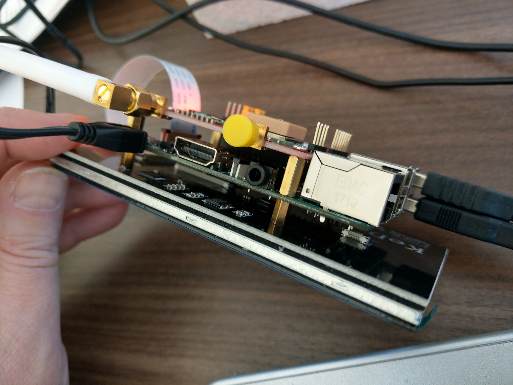
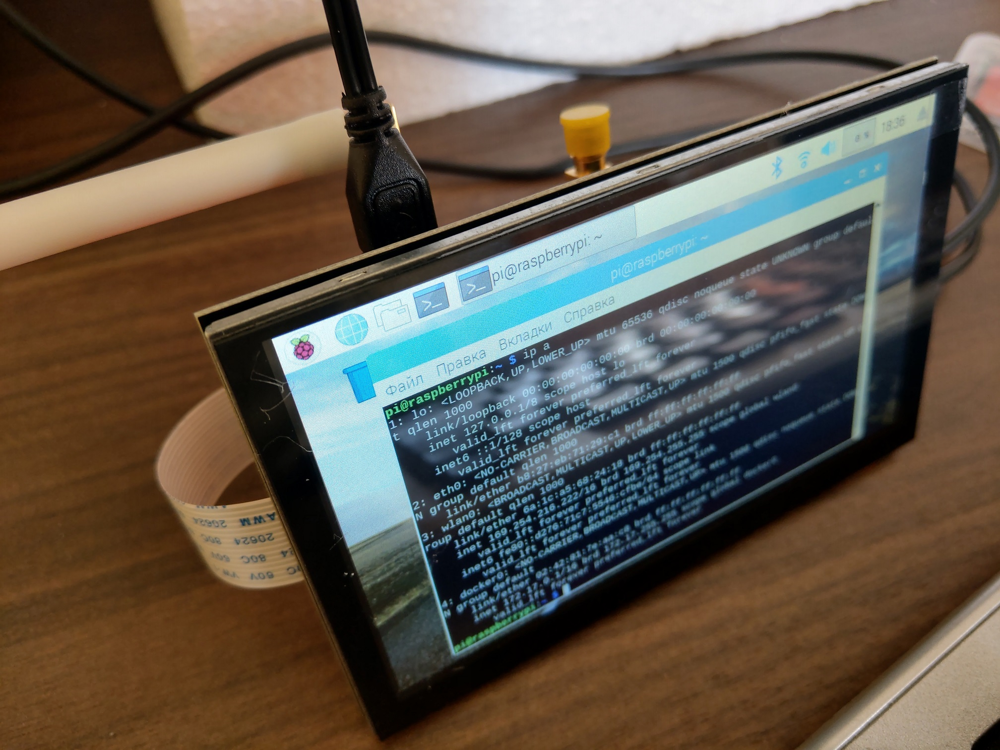
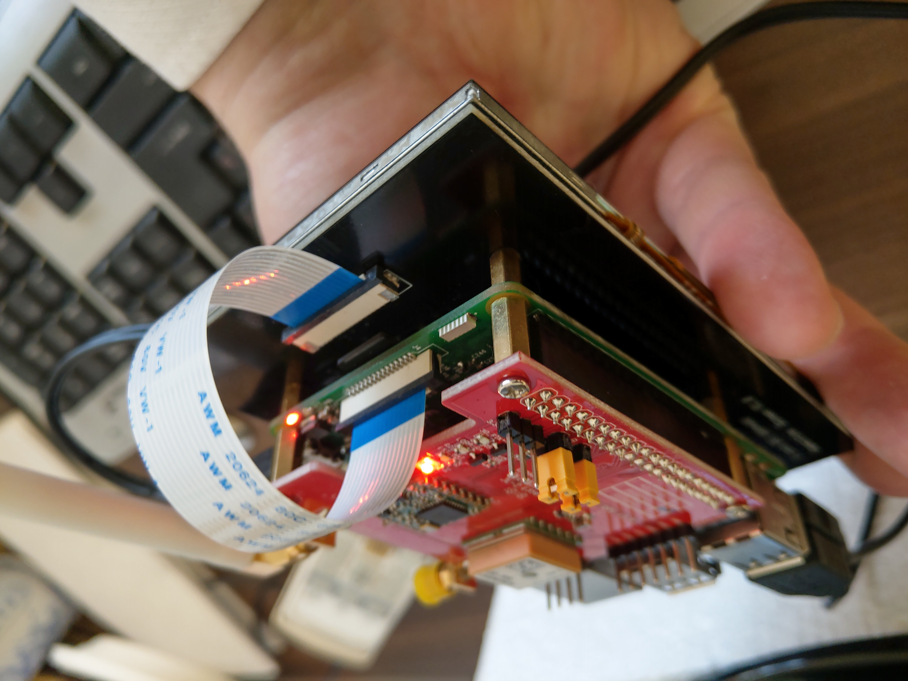
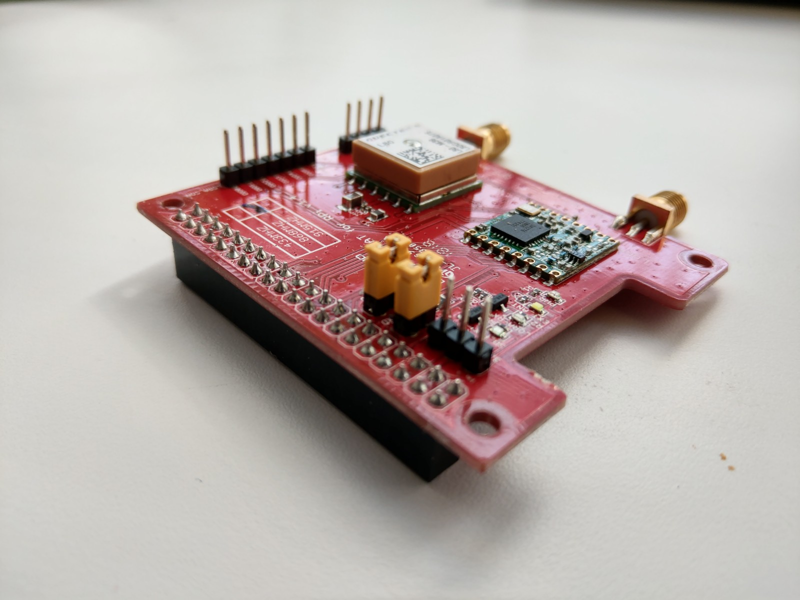
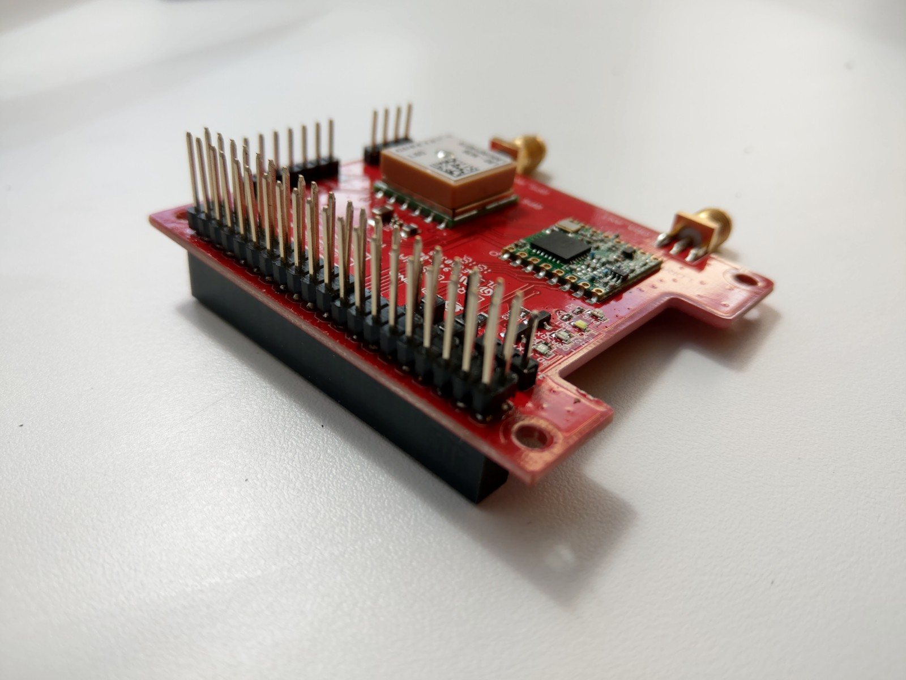
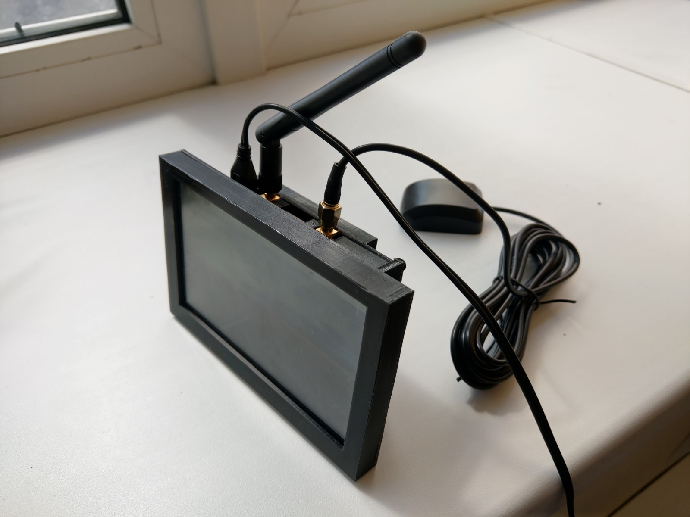
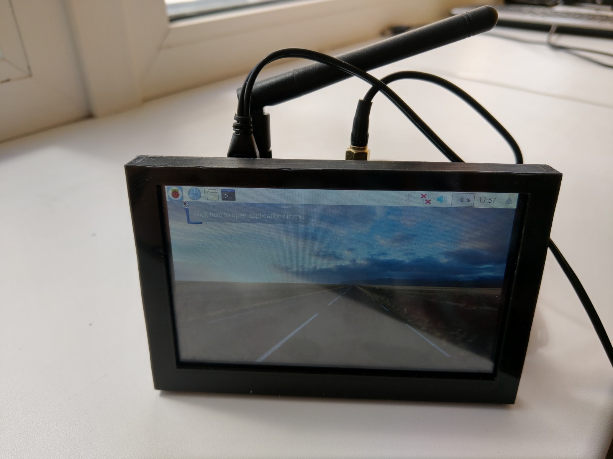
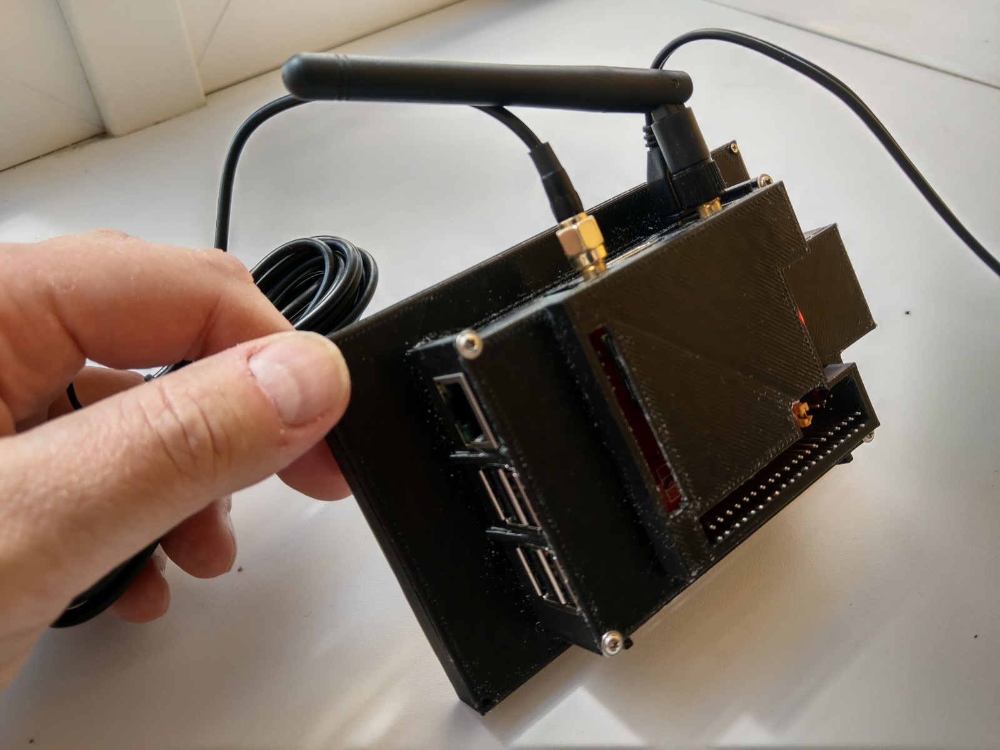
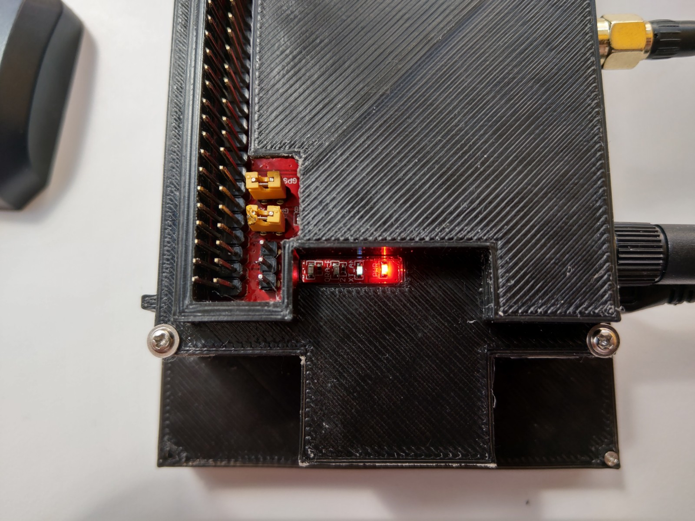
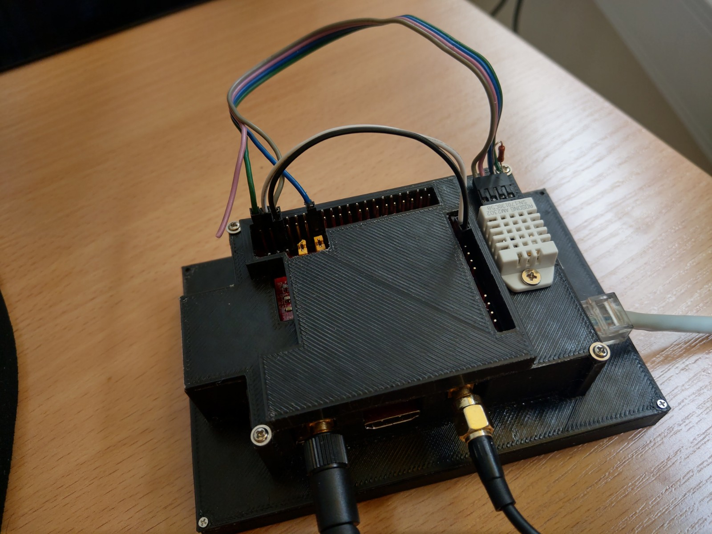

# 3DPrint_BodyCase4PRIandDraginoLoRaHATwithScreen
Files for 3D print the BodyCase for assebled RaspberryPI3 + Dragino LoRa Hat + 5" 800x480 DSI Screen

There is the project for 3D print the case for assebled device from next components:

<ol><li>Raspberry Pi2/3/3+</li>
<li><a href="http://www.dragino.com/products/lora/item/106-lora-gps-hat.html">Dragino LoRa&GPS Hat for Raspberry Pi</a></li>
<li><a href="https://www.aliexpress.com/item/32954192404.html?spm=a2g0s.8937460.0.0.66932e0eVrc0Jg">5 inch 800x480 TFT Touch Screen LCD Display with DSI Connector for Raspberry Pi</a></li></ol>

This assembled device is very useful for any tests of LoRa technology but so fragile and can be damaged very easy.

</img> 
</img> 
</img> 

<h2>Modifying connector at Dragino board</h2>

First of all the Dragino board was modifyed to allow connect any additional HW (sensors and modules) to Raspberry GPIO connector without Body Case disassembling. The <a href="https://www.aliexpress.com/item/32898319378.html?spm=a2g0s.9042311.0.0.6f554c4du8pb8R">40-pins 'PC-140'-type connector</a> was used for replace original Dragino connector. (N.B. Of course, you must have a good experience in soldering and proper tools to change the connector without damaging the board.)

Original Dragino Hat</img>  
Modifyed Dragino Hat</img>  

<h2>3D-printable Body Case</h2>

To prevent possible damaging the 3D-printable case was deployed.  It contents three parts:

<ol>
<li>Front panel (screen cover) -- <a href="RPi3wScreen-FrontPanel.stl">.STL</a>, <a href="RPi3wScreen-FrontPanel.zip">.OBJ(ZIP)</a></li>
<li>Body -- <a href="./PRi3wScreen-Body.stl">.STL</a>, <a href="./PRi3wScreen-Body.zip">.OBJ(ZIP)</a></li>
<li>Hat cover -- <a href="./PRi3wScreen-Hat2.stl">.STL</a>, <a href="PRi3wScreen-Hat2.zip">.OBJ(ZIP)</a></li></ol>

<h2>How to asseble</h2><ol>
  <li>Put the Screen into printed Front Panel.</li>
  <li>Install printed Body part of case. Use any four small 2mm screws to fix the Body part at Front panel.</li>
  <li>Connect DSI interface to Display.</li>
  <li>Install previously prepared SD card into SD-slot at Raspberry.</li>
  <li>Install Raspberry into Body and fix it by brass cylinders from Dragino pack.</li>
  <li>Connect DSI interface to Raspberry.</li>
  <li>Install Dragino LoRa&GPS HAT at Raspberry and fix it by four screws.</li>
  <li>Close the body of cadse by Hat Cover and fix it by others four small screw.</li></ol>

Now your accembled device is ready for tests.

Assembled device</img>  
</img>  
</img>  
The Body Case has small windows for LEDs at Dragino and Raspberry boards.</img>  
With this case you can easy connect any additional sensors - DHT-22 for example.</img>

<h2>PRO & CONS</h2>
<h3>PRO</h3>
<ul>
  <li>You can easy connect any additional sensors and modules directly to Raspberry GPIO Connector and Dragino HAT pins without disassembling Body Case.</li>
  <li>The Body Case has special holes at the bottom for air cooling. Anyway using any special radiators for Raspberry CPU is the good idea.</li>
  <li>The Body Case has special small windows to look at the LEDs state - both on Dragino and Raspberry boards.</li>
</ul>
<h3>CONS</h3><ul>
  <li>The changing the SD-card is very hard procedure with this Body Case because DSI cable covers SD-slot. To change SD-card you will be able to partially disassemble this device to grant the access to SD-card slot. Sorry, but I have no ideas how to solve this issue.</li></ul>
